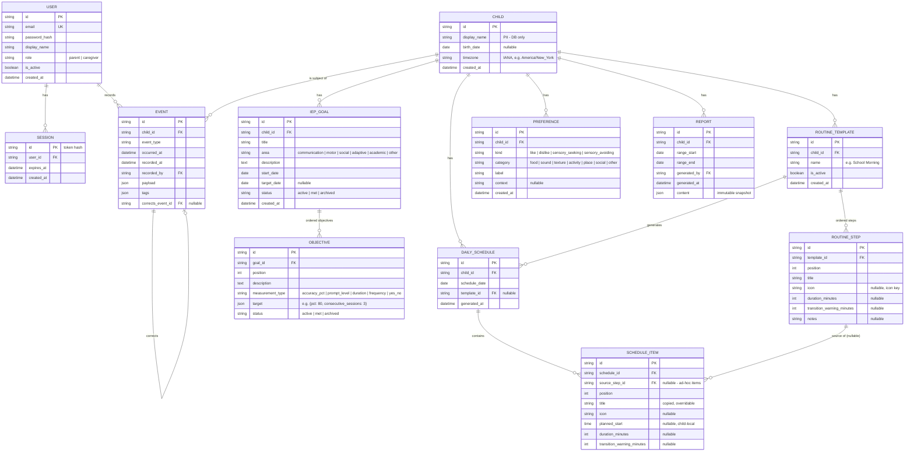

# Spectrum Schedule — Specification

A self-hosted web app for parents and caregivers of an autistic child. Two tightly
linked jobs: a visual **daily schedule** built from routine templates, and a
**developmental record** (IEP goals with measurable trials, preferences, observations,
ABC incidents) that surfaces trends and produces IEP-meeting-ready summaries.

Status: **draft — awaiting review before Phase 1 begins.**

---

## 1. Problem statement

Families of an autistic child juggle two kinds of information that existing tools keep
apart:

1. **The day itself.** Predictable routines with visual structure ("first–then"),
   advance warning of transitions, and a record of what actually happened versus what
   was planned.
2. **The developmental record.** IEP goals are only useful if trials are logged in the
   moment, and patterns (sleep ↔ regulation, antecedents ↔ behaviors, emerging
   likes/dislikes) only appear when everything lands in one timeline.

Commercial tools that do this are classroom-oriented, subscription-based, and put a
child's health data on third-party infrastructure. This app is self-hosted, runs on a
home server, and is reached only over infrastructure the family controls (Tailscale /
Cloudflare Tunnel). Two parents plus occasional caregivers use it, mostly from phones,
mostly in the moment — every logging flow must survive a 10-second, one-thumb
interaction.

### Non-goals

- **Not a medical device or clinical system.** No diagnosis, no treatment
  recommendations, no claims of clinical validity. It is a family's structured notebook.
- **No multi-tenant SaaS.** One family per deployment. No org hierarchy, no billing.
- **No third-party auth, analytics, or telemetry.** Ever.
- **No classroom features** (rosters, staff scheduling, billing codes, Medicaid
  paperwork).
- **Not building the child-facing view yet** (Phase 5 — the data model accommodates it,
  the UI does not exist until then).
- **No native mobile apps.** Installable PWA only.
- **No offline-first sync engine in early phases.** The PWA works online; offline
  queueing of quick-logs is a Phase 4 consideration, not a foundation requirement.

---

## 2. Architectural principle: event log first

Every meaningful occurrence is an append-only **event**. Definitions and configuration
(children, routine templates, goals, preference definitions) are ordinary mutable rows;
**things that happen** (a schedule item completed, a trial recorded, an observation,
an incident, evidence for a preference) are events and are never updated or deleted.

An event carries:

| field         | type               | notes                                              |
|---------------|--------------------|----------------------------------------------------|
| `id`          | UUID (string)      | primary key                                        |
| `child_id`    | FK → children      | every event belongs to exactly one child           |
| `event_type`  | string enum        | see catalog below                                  |
| `occurred_at` | datetime (UTC)     | when it happened in the world                      |
| `recorded_at` | datetime (UTC)     | when it was written (server clock)                 |
| `recorded_by` | FK → users         | who logged it                                      |
| `payload`     | JSON               | typed per `event_type`, validated by Pydantic      |
| `tags`        | JSON array of str  | free-form, e.g. `["school", "mealtime"]`           |
| `corrects_event_id` | FK → events, nullable | correction chain (see below)                |

### Corrections, not edits

Nothing is hard-deleted or updated in place. To fix a mistake, append a new event with
`corrects_event_id` pointing at the event it supersedes; to retract entirely, append a
correction whose payload marks it `retracted`. Projections resolve each correction
chain to its newest event before computing anything. The full chain remains queryable
for audit ("who changed this trial score and when").

### Event type catalog (initial)

| `event_type`              | payload (validated shape)                                            | phase |
|---------------------------|----------------------------------------------------------------------|-------|
| `schedule_item_completed` | `{schedule_item_id, planned_date}`                                   | 1     |
| `schedule_item_skipped`   | `{schedule_item_id, planned_date, reason?}`                          | 1     |
| `note_added`              | `{text, subject_type?, subject_id?}`                                 | 1     |
| `trial_recorded`          | `{objective_id, measurement_type, value, prompt_level?, context?}`   | 2     |
| `preference_evidence`     | `{preference_id, direction: +1 \| -1, context?, note?}`              | 3     |
| `observation_recorded`    | `{mood?: 1–5, regulation?: 1–5, sleep_hours?, sleep_quality?, text?}`| 3     |
| `incident_recorded`       | `{antecedent, behavior, consequence, intensity: 1–5, duration_minutes?, location?}` | 3 |

Payload schemas are versioned implicitly by being additive-only; a breaking payload
change gets a new `event_type` (e.g. `trial_recorded_v2`).

### Projections

All read models are computed **from the event stream** joined with definition tables:

| projection                | inputs                                            | consumed by            |
|---------------------------|---------------------------------------------------|------------------------|
| Today's schedule status   | schedule items + completed/skipped events         | Today screen           |
| Goal/objective progress   | trials per objective, resolved for corrections    | Goal progress screen   |
| Streaks & routine adherence | completed/skipped events over date ranges       | Trends                 |
| Preference confidence     | signed `preference_evidence` sum with recency decay | Preference list      |
| Mood/regulation/sleep trend lines | observation events bucketed by day        | Trends, Reports        |
| Incident patterns         | incident events grouped by antecedent/time-of-day | Trends, Reports        |
| Date-range report         | all of the above over a range                     | Report screen / export |

**Where computed and cached:** projections are pure functions
(`api/app/projections/*.py`) that take resolved events and return plain data — every
one is unit-testable against fixture event lists with no database. At current scale
(one family, a handful of events per day, SQLite) they run on demand per request; no
denormalized status columns anywhere. Two exceptions are cached:

- **Reports** are expensive and reviewed repeatedly before IEP meetings, so a generated
  report is persisted as a `Report` row (immutable snapshot of its date range).
- **Phase 4** adds a generic `projection_cache` table
  (`child_id, projection_name, params_hash → result JSON, last_event_id`) invalidated
  whenever a newer event for that child exists. This is an optimization slot, not a
  correctness requirement — dropping the cache must never change any answer.

---

## 3. Data model

Conventions (apply to every table):

- Primary keys are UUIDv4 stored as `String(36)`. No SQLite-only types; everything maps
  1:1 onto Postgres.
- All datetimes are timezone-aware UTC (`DateTime(timezone=True)`, stored UTC).
  Calendar concepts (schedule dates) are `Date` plus the child's IANA timezone.
- `created_at` / `updated_at` on definition tables; events get `recorded_at` only.
- Child names (and any PII) exist **only** as database values — never in code,
  fixtures, seeds, logs, or commit messages.

Notes on entities the brief names that are *not* tables:

- **Trial** — a `trial_recorded` event, not a table. Trials are the canonical example
  of the event-first rule: appended in the moment, corrected by chain, charted by
  projection.
- **Observation / Incident** — likewise pure events.
- **Preference confidence** — derived, never stored on the row: signed sum of
  `preference_evidence` events with exponential recency decay (half-life ~90 days,
  tunable). A preference row is a *definition* ("crunchy textures", sensory_seeking,
  category texture); confidence is what the evidence currently says.
- **Schedule item status** — derived from completed/skipped events; there is no status
  column to drift out of sync.

### How this stays cheap for the Phase 5 child-facing view

The child view is a read-only projection of `DAILY_SCHEDULE` + `SCHEDULE_ITEM` + item
status, which already carries `icon`, ordering, and first–then structure. Adding it
later means: one new read-only role/token type, one new frontend route with big
visuals, zero schema changes. `icon` keys and per-item visuals are therefore part of
the Phase 1 schema even though Phase 1 renders them small.

---

## 4. API surface

All endpoints under `/api/v1` (the reverse proxy strips nothing; the Next.js dev server
rewrites `/api/*` to the API service). JSON only. Session cookie auth (`HttpOnly`,
`Secure`, `SameSite=Lax`); CSRF protected via double-submit token on mutating requests.

### Roles

- **parent** — full access: manage users, children, templates, goals; log anything;
  generate reports; correct anyone's events.
- **caregiver** — day-to-day access: read schedules/goals/preferences, log events
  (completions, trials, observations, incidents, preference evidence, notes), correct
  **their own** events. Cannot manage users, children, templates, goal definitions, or
  generate/read reports.

| method & path | purpose | parent | caregiver |
|---|---|---|---|
| **auth** |
| `POST /auth/login` | email+password → session cookie | ✓ | ✓ |
| `POST /auth/logout` | destroy session | ✓ | ✓ |
| `GET /auth/me` | current user + role | ✓ | ✓ |
| **users** |
| `GET /users` · `POST /users` · `PATCH /users/{id}` | invite/deactivate accounts | ✓ | — |
| **children** |
| `GET /children` | list children | ✓ | ✓ |
| `POST /children` · `PATCH /children/{id}` | manage | ✓ | — |
| **routine templates** |
| `GET /children/{id}/templates` | list with steps | ✓ | ✓ |
| `POST /children/{id}/templates` · `PATCH /templates/{id}` · steps CRUD | manage | ✓ | — |
| **daily schedules** |
| `GET /children/{id}/schedule?date=` | schedule + per-item status (projection) | ✓ | ✓ |
| `POST /children/{id}/schedule` | generate for a date from a template | ✓ | ✓ |
| `PATCH /schedule-items/{id}` · `POST …/items` | per-day overrides, ad-hoc items | ✓ | ✓ |
| **events** |
| `POST /children/{id}/events` | append event (any type; payload validated) | ✓ | ✓ |
| `GET /children/{id}/events?type=&from=&to=&tag=` | filtered timeline | ✓ | ✓ |
| `POST /events/{id}/correct` | append correction event | ✓ | own only |
| **goals** (Phase 2) |
| `GET /children/{id}/goals` | goals + objectives + progress projection | ✓ | ✓ |
| `POST /children/{id}/goals` · `PATCH /goals/{id}` · objectives CRUD | manage | ✓ | — |
| `GET /objectives/{id}/progress?from=&to=` | trial chart data (projection) | ✓ | ✓ |
| **preferences** (Phase 3) |
| `GET /children/{id}/preferences` | definitions + current confidence | ✓ | ✓ |
| `POST /children/{id}/preferences` · `PATCH /preferences/{id}` | manage definitions | ✓ | — |
| **trends & reports** (Phase 4) |
| `GET /children/{id}/trends?metric=&from=&to=` | trend projections | ✓ | — |
| `POST /children/{id}/reports` · `GET /reports/{id}` | generate / fetch snapshot | ✓ | — |
| **ops** |
| `GET /health` | liveness (unauthenticated) | ✓ | ✓ |

Convenience endpoints like "mark item done" are thin wrappers that append the
corresponding event — there is exactly one write path into history.

Trials, observations, incidents, and preference evidence are all logged through
`POST /children/{id}/events`; their read views are projections
(`/goals`, `/objectives/{id}/progress`, `/preferences`, `/trends`), so no separate
CRUD resources exist for them.

---

## 5. Frontend

Next.js App Router, TypeScript, custom CSS modules (no Tailwind, no UI kit). Installable
PWA (manifest + service worker for shell caching). Mobile viewport first; desktop is a
wider arrangement of the same components.

### Route map

| route | screen | phase |
|---|---|---|
| `/login` | email + password | 1 |
| `/` | **Today's schedule** (default child, default = today) | 1 |
| `/log` | **Quick-log** hub | 1 (notes) → 3 (full) |
| `/goals` | goal list with progress bars | 2 |
| `/goals/[goalId]` | **Goal progress** — objectives, trial charts, quick trial entry | 2 |
| `/routines` · `/routines/[templateId]` | template editor | 1 |
| `/preferences` | preference list sorted by confidence | 3 |
| `/timeline` | filterable event timeline (audit + browsing) | 3 |
| `/trends` | mood/sleep/regulation/incident charts | 4 |
| `/reports` · `/reports/[reportId]` | generate & review IEP summaries (print CSS) | 4 |
| `/settings` | children, users, PWA install hint | 1 |

### The three key mobile screens

**Today's schedule (`/`)** — the home screen. Vertical list of large tappable cards:
icon, title, planned time, duration. Current item is visually dominant; the next item
renders beneath it as a "then" preview (first–then built into the layout, not a mode).
A transition-warning banner appears `transition_warning_minutes` before an item ends.
One tap marks done (with a brief undo affordance → correction event); long-press or
swipe reveals skip-with-reason. Done items collapse to slim rows so the remaining day
stays above the fold.

**Quick-log (`/log`)** — optimized for one thumb in under ten seconds. A grid of large
buttons: *Trial*, *Observation*, *Incident*, *Preference*, *Note*. Each opens a single
screenful — no scrolling to reach Save: trial = objective picker (recent first) + the
measurement control for its type; observation = two 1–5 tap scales + optional text;
incident = A/B/C free-text trio + intensity; preference = search-or-create + 👍/👎.
Save appends the event and returns to the grid with a toast + undo.

**Goal progress (`/goals/[goalId]`)** — objective cards each with a sparkline of
resolved trials, latest value vs. target, and a "log trial" button that deep-links into
quick-log with the objective pre-selected. Range toggle (30/90 days/since start) drives
the projection query used later by reports, so what parents see here matches what the
IEP report says.

---

## 6. Phased build plan

Each phase lands as migrations + API + tests + UI, deployable at every phase boundary.

- **Phase 1 — Foundation.** Auth (sessions, roles, user management), children CRUD,
  routine templates & steps, daily schedule generation with per-day overrides, the
  event table + `schedule_item_completed`/`skipped`/`note_added` + corrections,
  today-screen and template editor UI, PWA manifest. Docker Compose deployable.
- **Phase 2 — IEP goals.** Goals & objectives CRUD, `trial_recorded` events, all five
  measurement types, progress projections, goal list + goal progress screens, trial
  quick-log.
- **Phase 3 — The record.** Preferences with evidence & confidence decay, observations,
  ABC incidents, full quick-log hub, event timeline screen.
- **Phase 4 — Insight.** Trend projections (mood/regulation/sleep lines, incident
  patterns, routine adherence), report generation & snapshot storage, print stylesheet,
  `projection_cache`, offline quick-log queueing (evaluate).
- **Phase 5 — Child-facing view (deferred).** Read-only visual schedule with big icons,
  first–then focus mode, no ability to see the developmental record. Not designed
  beyond the data-model accommodations above.

---

## 7. Open questions (answers needed before Phase 1)

1. **Timezone:** one home timezone per child (schedules interpreted in it) — is a
   single-timezone assumption fine, or do you split time between households?
2. **Prompt levels:** which hierarchy for `prompt_level` trials? Proposed default:
   independent → gestural → verbal → modeled → partial physical → full physical.
   Should match the school's IEP wording.
3. **Caregiver visibility:** the table above hides reports/trends and user/child/goal
   management from caregivers but shows goals, preferences, and the timeline. Right
   line? Should caregivers see incident history, or only log into it?
4. **Schedule generation:** auto-generate each day from a default template (per
   weekday?) with manual override, or always explicit "start today from template X"?
   Proposed: per-weekday default template with one-tap regenerate.
5. **Transition warnings:** in-app visual banner only, or also push notifications
   (needs web-push infrastructure — real work, would land Phase 4)?
6. **Account bootstrap:** first parent account created via CLI command on the server
   (proposed), or a one-time setup page?
7. **Report format:** is print-CSS (browser print-to-PDF) sufficient for IEP meetings,
   or is server-side PDF generation required?
8. **Backups:** out of app scope (host-level SQLite file copy), or do you want an
   authenticated export endpoint (full JSON/SQLite dump) in Phase 1?
9. **Multiple children:** confirmed as supported — is a simple global child-switcher in
   the header sufficient (no per-user child restrictions)?
